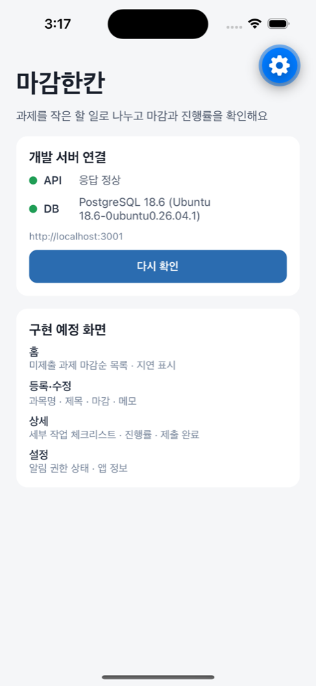

# EC2 개발 서버 — 2026-10-02 구성 기록

[Server-Plan](../wiki/Server-Plan.md)의 최소 구성을 실제로 생성·검증한 기록입니다. 공인 IP·계정 ID·DB 비밀번호는 공개 저장소에 적지 않습니다.

## 계정과 리전

- AWS 계정은 Organization 소속이며 서비스 제어 정책(SCP)으로 **ap-southeast-2(시드니) 외 리전이 차단**되어 있습니다. 서울(ap-northeast-2)은 EC2 조회도 거부되어, 계획의 서울 리전 대신 시드니에 생성했습니다.
- 계정 플랜: AWS Free plan, 크레딧 USD 100, 만료 2027-03-14 (2026-10-02 조회). 생성 전 비용 사용액 0.
- CLI 로그인: `aws login --region ap-southeast-2` (콘솔 계정 브라우저 승인, 장기 액세스 키 없음). 콘솔 세션이 시드니 로그인 도메인이라 `--region ap-southeast-2`로 로그인해야 세션 선택이 됩니다.

## 생성한 리소스 (ap-southeast-2)

| 리소스 | 값 | 비고 |
| --- | --- | --- |
| EC2 | `i-06cec8f169a4b3014` · `magam-hankan-dev` · t3.micro · ap-southeast-2a | Ubuntu 26.04.1 LTS, CPU 크레딧 **standard**(초과 과금 방지), IMDSv2 필수 |
| EBS | gp3 20 GiB, 암호화, 종료 시 삭제 | 스왑 1 GiB 포함 |
| 보안 그룹 | `magam-hankan-dev-sg` | 인바운드는 **SSH 22, 개발자 맥 IP /32만**. 80·443·3000·5432 미개방 |
| 키 페어 | `magam-hankan-dev` (ed25519) | 개인 키는 개발자 맥 `~/.ssh/magam-hankan-ec2`에만 존재 |
| 공인 IPv4 | 자동 할당 (Elastic IP 아님) | 인스턴스 중지·시작 시 바뀜. 재부팅은 유지 |

### 예상 비용 (AWS Price List API, 시드니 온디맨드)

| 항목 | 단가 | 월(730시간) |
| --- | --- | --- |
| t3.micro | $0.0132/시간 | $9.64 |
| gp3 20 GiB | $0.096/GB-월 | $1.92 |
| 공인 IPv4 | $0.005/시간 | $3.65 |
| 합계 | | **약 $15.2/월** (데이터 전송 소량 별도) |

크레딧 $100 기준 약 6개월. 사용하지 않는 기간에 인스턴스를 **중지**하면 인스턴스 요금은 멈추지만 EBS·(유휴) IP 요금은 남습니다. 삭제는 `terminate-instances`로 하며 DB가 함께 사라지므로 백업을 먼저 받습니다.

## 서버 구성

```text
인터넷 ──(22, 개발자 IP만)──> sshd
                               │ SSH 터널
            127.0.0.1:3000  magam-api.service (Node 24.21.0, User=magam)
            127.0.0.1:5432  PostgreSQL 18.6 (DB magam_hankan, 역할 magam_app)
```

- 설치·배포: `infra/ec2/setup-server.sh [git-ref]` — 재실행 가능. 스왑, PostgreSQL, Node(공식 tarball·체크섬 확인), 앱 사용자 `magam`, 코드(`/srv/magam-hankan`, 지정 ref로 detach), `npm ci`·빌드·마이그레이션, systemd 등록, 백업 cron.
- 비밀 값: DB 비밀번호는 서버에서 `openssl rand`로 생성해 `/etc/magam-hankan/api.env`(root:magam 640)에만 저장. 출력·커밋하지 않음.
- DB 역할 `magam_app`: superuser·createdb·createrole 없음, 자기 DB 소유자. PUBLIC의 DB 접근 회수.
- 서비스: `infra/ec2/magam-api.service` — `Restart=on-failure`, `ProtectSystem=strict` 등 기본 격리.
- 백업: `/usr/local/sbin/magam-backup` 매일 18:30 UTC(03:30 KST), `/var/backups/magam-hankan`(root 700)에 `pg_dump -Fc` 7개 보관. **같은 서버 안의 백업**이므로 큰 변경 전에는 맥으로 내려받습니다.

## 사용 방법

```bash
ssh magam-dev                                   # ~/.ssh/config 별칭 (개발자 맥)
ssh -N -L 3001:127.0.0.1:3000 magam-dev         # 터널: 맥 localhost:3001 → 서버 API
curl http://127.0.0.1:3001/health/db

# 서버 배포 (develop 기준)
scp infra/ec2/setup-server.sh magam-dev:~ && ssh magam-dev 'bash ~/setup-server.sh develop'

# 운영 확인
ssh magam-dev 'systemctl status magam-api --no-pager; journalctl -u magam-api -n 50 --no-pager'

# 백업 내려받기
ssh magam-dev 'sudo cat "$(sudo ls -1t /var/backups/magam-hankan/*.dump | head -1)"' > magam_hankan-backup.dump
```

시뮬레이터에서 서버를 쓰려면 터널을 연 뒤 `apps/mobile/.env.local`의 `EXPO_PUBLIC_API_BASE_URL=http://localhost:3001`로 바꾸고 `npx expo start --clear`로 다시 시작합니다(셸 환경 변수보다 `.env.local`이 우선 적용됨을 확인).

개발자 IP가 바뀌면 SSH가 막힙니다. 콘솔 또는 `aws ec2 authorize-security-group-ingress`로 새 IP /32를 추가하고 이전 규칙을 삭제합니다.

## 실제 검증 결과 (2026-10-02)

| 항목 | 결과 |
| --- | --- |
| 서버에서 `/health`, `/health/db` | 200 · PostgreSQL 18.6 (Ubuntu) |
| 수신 포트 | 3000·5432는 127.0.0.1만, 외부는 22만 |
| 맥에서 공인 IP의 3000·5432·80 접속 | 차단 |
| 맥 → SSH 터널 → API → DB | 200 |
| 서버 재부팅 후 | postgresql·magam-api 자동 시작, `/health/db` 200 |
| 백업 실행 → 임시 DB로 복원 | 테이블 4개·마이그레이션 기록 복원 확인 후 임시 DB 삭제 |
| `api.env` 권한 · 로그에 접속 문자열 | 640 root:magam · 0건 |
| iPhone 16 시뮬레이터 → 터널 → EC2 | API 정상, DB "PostgreSQL 18.6 (Ubuntu …)" 표시 |



## 아직 하지 않은 것

- **HTTPS·Nginx**: 도메인이 없어 미구성. 실제 휴대폰은 아직 서버에 붙을 수 없습니다(터널은 맥 전용). 도메인 확보 또는 IP 인증서 방식 결정 후 443만 개방합니다.
- 고정 IP(Elastic IP), 서버 밖 백업 보관, 개발자별 서버 작업 폴더·계정(현재 `ubuntu` 한 계정과 키 하나), 비용 알림(Budgets).
- 인증·소유자 검사 API (W05–W06).
