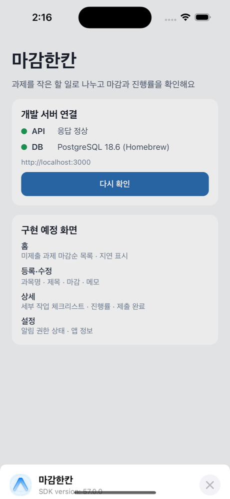

# 맥북 개발 환경 세팅 기록 — 2026-10-02

작업자: 박초원 맥북 · Claude Code 보조. 기준 문서: `msp-claude-handoff-2026-09-30.txt`.
이 기록은 이 맥북에서 실제로 실행·확인한 내용만 적습니다. 원격 push·PR·AWS 리소스 생성은 하지 않았습니다.

## 출발 상태 확인

- GitHub 원격은 9/30 인수인계 상태와 같았습니다: master `4117f8d`, develop `cde44d1`, codex/ec2-server-plan `ade2b2f`, PR #8 열림·미병합, Issue #3–#6 열림.
- master/develop에는 문서 14개만 있었고 앱·API 코드는 없었습니다.
- README·Architecture·Requirements·.env.example은 "기기 내부 SQLite, 로그인·서버 제외" 초기안이었고, PR #8과 최신 방향(EC2 API + PostgreSQL)과 충돌했습니다. 이 브랜치에서 문서를 최신 방향으로 정리했습니다.

## 설치·사용 버전

| 도구 | 버전 | 비고 |
| --- | --- | --- |
| macOS | 15.3.2 (Apple Silicon) | |
| Node.js | 24.21.0 (Active LTS "Krypton") | Expo SDK 57 요구: `^22.13 \|\| ^24.3 \|\| >=26` |
| npm | 11.19.0 | 앱별 `package-lock.json` 사용 |
| Git | 2.39.5 (Apple) | 저장소 로컬 user.name/email만 설정 |
| Xcode | 16.2 | iOS 18.3.1 시뮬레이터 런타임 설치 |
| Expo SDK / Expo Go | 57.0.26 / 57.0.9 | React Native 0.86.3, React 19.2.3 |
| Express / pg | 5.2.1 / 8.23.1 | TypeScript 7.0 (API), 6.0 (mobile, Expo 템플릿) |
| PostgreSQL (로컬) | 18.6 (Homebrew `postgresql@18`) | Ubuntu 26.04 LTS 기본 버전과 맞춤 |
| watchman | 2026.09.21.00 | Homebrew |
| GitHub CLI | 2.102.0 | 설치만 함, 로그인 전 |
| 편집기 | Cursor | 이미 설치됨 |

참고: 기존 Homebrew `postgresql@14`(2026-11-12 지원 종료 예정)와 전역 legacy `expo-cli` 6.3.12는 그대로 두었습니다. `expo` 명령은 전역이 아니라 `npx expo`로 실행합니다. PATH의 `psql`은 14 버전이므로 18은 `/opt/homebrew/opt/postgresql@18/bin/psql`로 실행합니다.

## 폴더 구조

```text
apps/
  mobile/   Expo · React Native · TypeScript (첫 화면 + API/DB 연결 상태)
  api/      Node · Express · TypeScript
    src/            app.ts(라우트), config.ts, db.ts, index.ts
    db/migrations/  001_init.sql (users → assignments → subtasks)
    scripts/        migrate.ts, seed.ts (합성 데이터)
    test/           health.test.ts (vitest + supertest)
docs/setup/        이 기록과 검증 화면
```

## 실행 명령

```bash
npm run install:all          # 두 앱 의존성 설치
npm run api                  # API 개발 서버 (tsx watch) → http://127.0.0.1:3000
npm run ios                  # Metro + iOS 시뮬레이터(Expo Go)
npm run check                # API 타입검사·테스트 + 모바일 타입검사

npm --prefix apps/api run db:migrate   # 마이그레이션 (재실행 안전)
npm --prefix apps/api run db:seed      # 합성 데이터 (NODE_ENV=production이면 거부)
npm --prefix apps/api run build && npm --prefix apps/api start   # 빌드 결과 실행

brew services start postgresql@18      # 로컬 DB 시작 (stop으로 중지)
```

API 엔드포인트: `GET /health` → `{status:"ok"}`, `GET /health/db` → DB 연결 시 200, 미설정·장애 시 503(오류 상세는 응답에 넣지 않음).

## 실제 검증 결과

| 항목 | 결과 |
| --- | --- |
| API 타입검사 · 테스트 | 통과 (vitest 5개) |
| 모바일 타입검사 | 통과 |
| API 빌드 후 실행, `curl /health` | 200 |
| `/health/db` DATABASE_URL 없음 | 503 `unconfigured` |
| 로컬 PostgreSQL 18 마이그레이션 · 재실행 | 적용 후 "up to date" |
| 합성 데이터 시드 · 재실행 | 중복 없이 유지 |
| 과제 삭제 시 세부 작업 연쇄 삭제 | 확인 (트랜잭션 롤백으로 원복) |
| 빈 과목명 저장 | CHECK 제약으로 거부 |
| DB 중지 → `/health/db` → DB 재시작 | 200 → 503 → 200 |
| iPhone 16 시뮬레이터(iOS 18.3) · Expo Go 57.0.9 첫 화면 | API "응답 정상", DB "PostgreSQL 18.6" 표시 |



검증하지 않은 것: 실제 휴대폰, 로컬 알림, EC2·Nginx·HTTPS·systemd, 사용자 인증, 서버 연결 완료. 첫 실행 시 Expo Go 설치 직후 URL 열기가 한 번 시간 초과됐고, 다시 열었을 때 정상 표시됐습니다.

## 아직 필요한 정보 (필요할 때 요청)

- GitHub: AllaboutZENA 계정으로 `gh` 로그인 완료(admin). min2030은 write 권한으로 수락됨. Projects 보드 변경에는 `project` 권한 추가가 필요.
- 올바른 AWS 계정(IAM 로그인 URL 또는 콘솔 접근), 기존 EC2 유무, 비용·지출 한도 승인.
- EC2 접속 정보: 인스턴스 ID·공인 IP/DNS, SSH 사용자, 키 위치, HTTPS 도메인.
- 서버 DB 이름·계정·비밀번호(서버에만 보관), 인증 방식.
- 기준 테스트 휴대폰(iPhone/Android, OS 버전), 강의계획서 주차·날짜.

## 다음 작업

1. (완료) PR #8 병합, 이 브랜치 PR 병합, W01–W10 GitHub 마일스톤 생성.
2. 올바른 AWS 계정으로 로그인해 기존 리소스를 조회하고, 비용 승인 후 t3.micro에 API·PostgreSQL·Nginx를 구성합니다.
3. 인증 방식과 화면 4개를 확정하고 과제 등록·조회 API와 화면(5주차 범위)을 구현합니다. 같은 시기에 실제 휴대폰에서 로컬 알림을 실험합니다.
