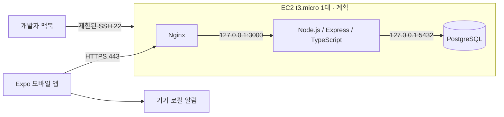
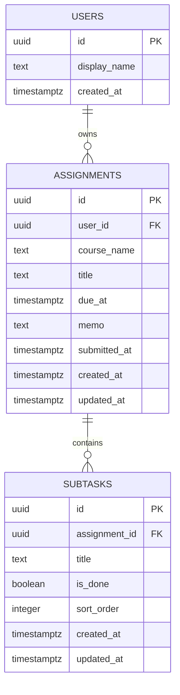

# 구조 설계 — EC2 API · PostgreSQL 초안

2026-10-02 갱신. 초기안의 "화면 → 기기 내부 SQLite" 구조를 EC2 한 대의 API·PostgreSQL 구조로 바꿨습니다. 서버 구성의 상세(보안 그룹, 비용 확인, 운영 절차)는 [PR #8의 Server-Plan](https://github.com/AllaboutZENA/msp-2026-one-step/blob/codex/ec2-server-plan/docs/wiki/Server-Plan.md)을 따릅니다. AWS 리소스는 아직 생성하지 않았습니다.

| 계층 | 위치 | 역할 |
| --- | --- | --- |
| 모바일 | `apps/mobile` | 화면 4개, 입력 검증, API 호출, 로컬 알림 예약·취소 |
| API | `apps/api` | 인증·소유자 검사, 과제·세부 작업 CRUD, 진행률·정렬 계산 |
| DB | `apps/api/db/migrations` | users → assignments → subtasks, 외래 키 연쇄 삭제 |

진행률과 정렬은 화면·라우트 밖의 순수 함수로 분리하여 시간을 고정한 자동 테스트로 확인한다.

## 데이터 구조

초안 마이그레이션: `apps/api/db/migrations/001_init.sql` (로컬 PostgreSQL 18에서 적용·연쇄 삭제·빈 문자열 검사 확인).

- 인증 관련 컬럼은 인증 방식을 정한 뒤(3–4주차) 별도 마이그레이션으로 추가한다.
- 과목은 별도 테이블 없이 문자열로 저장한다. 과목 마스터 관리가 필요해지면 요구사항 변경을 먼저 기록한다.
- 알림 예약 ID는 휴대폰 OS에만 의미가 있으므로 서버 DB에 두지 않고 기기에 저장한다.

## 동작 규칙

- 날짜·시간은 `timestamptz`(UTC 기준)로 저장하고 화면에는 기기 현지 시간으로 표시한다. 시간대 변경 시 마감의 절대 시점은 유지한다.
- 진행률은 세부 작업 완료 수 / 전체 수 × 100을 반올림한다. 전체 0개이면 0%다.
- 작업이 모두 완료돼도 제출 완료는 자동 전환하지 않는다. 사용자가 제출 완료를 누른 시점을 `submitted_at`에 기록하고, 되돌리면 NULL로 바꾼다.
- 미제출 목록은 due_at 오름차순, 동률이면 created_at, id 순으로 정렬한다.
- 미제출이고 due_at이 현재 시각보다 작으면 지연으로 표시한다.
- 과제 삭제 시 연관 세부 작업은 외래 키 `ON DELETE CASCADE`로 함께 삭제한다.
- 모든 과제·세부 작업 요청은 로그인한 사용자의 소유인지 검사한다. 다른 사용자의 과제 ID로 조회·수정·삭제하면 존재 여부를 드러내지 않고 404로 응답한다.
- 알림 ID를 기기에 저장하여 변경·삭제·제출 완료 때 예약을 취소한다. 제출 완료를 되돌릴 때는 알림 허용 상태와 예약 시각을 다시 확인한다.
- 서버 저장과 OS 알림 예약은 하나의 트랜잭션이 아니다. 알림 예약 실패가 과제 저장 성공을 무효화하지 않도록 별도 상태 안내·재시도를 설계한다.
- 네트워크 오류나 서버 장애 시 입력 내용을 유지하고 성공으로 표시하지 않는다. 오프라인 저장·다중 기기 실시간 동기화는 범위 밖이다.

## 환경 변수

| 위치 | 변수 | 설명 |
| --- | --- | --- |
| `apps/api/.env` | `HOST`, `PORT`, `NODE_ENV`, `DATABASE_URL` | 서버 비밀 값은 서버에만 보관 |
| `apps/mobile/.env.local` | `EXPO_PUBLIC_API_BASE_URL` | 앱에 포함되어 공개됨. 비밀 값 금지 |

확정할 사항: 인증 방식, 기준 테스트 기기·OS, 화면 이동 도구, 날짜 입력 UI, 실제 알림 지원 동작, EC2 AMI·리전·도메인.
