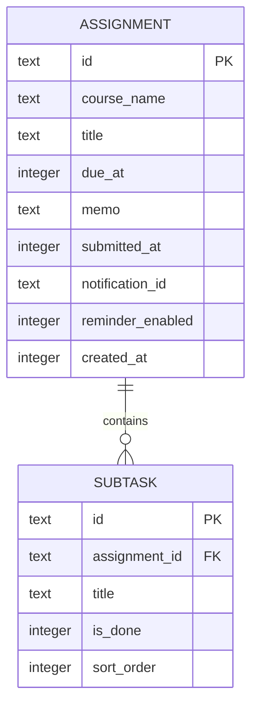

# 구조 설계 — 구현 전 초안

화면 → 저장·조회 함수 → SQLite의 단순 구조를 사용한다. 진행률과 정렬은 화면 밖의 순수 함수로 분리하여 확인하기 쉽게 만든다.

MVP는 별도 과목 테이블 없이 과제의 과목명을 문자열로 저장한다. 과목 마스터 관리가 필요해지면 요구사항 변경을 먼저 기록한다. `submitted_at`과 `notification_id`는 없을 수 있다.

- 날짜·시간은 UTC 기준 Unix 밀리초로 저장하고 화면에는 기기 현지 시간으로 표시한다. 시간대 변경 시 마감의 절대 시점은 유지한다.
- 진행률은 세부 작업 완료 수 / 전체 수 × 100을 반올림한다. 전체 0개이면 0%다.
- 작업이 모두 완료돼도 제출 완료는 자동 전환하지 않는다. 사용자가 제출 완료 버튼을 누른 시점을 기록한다.
- 미제출 목록은 due_at 오름차순, 동률이면 created_at, id 순으로 정렬한다.
- 미제출이고 due_at이 현재 시각보다 작으면 지연으로 표시한다.
- 과제 삭제 시 연관 세부 작업도 함께 삭제한다. SQLite 외래 키와 트랜잭션 적용 여부를 구현·검증한다.
- 알림 ID를 저장하여 변경·삭제·제출 완료 때 예약을 취소한다. 제출 완료를 되돌릴 때는 알림 허용 상태와 예약 시각을 다시 확인한다.
- 데이터 저장과 OS 알림 예약은 하나의 DB 트랜잭션이 아니다. 알림 예약 실패가 과제 저장 성공을 무효화하지 않도록 별도 상태 안내·재시도를 설계한다.
- 단말 내부 저장이므로 앱 삭제·기기 변경 시 데이터가 유지된다고 보장하지 않는다. 사용자 안내에 저장 범위를 명시한다.

확정할 사항: 팀의 스택 경험, 테스트 기기·OS, 화면 이동 도구, 날짜 입력 UI, 실제 알림 지원 동작. 앱 생성 후 실행에 사용한 의존성 버전을 README에 기록한다.
