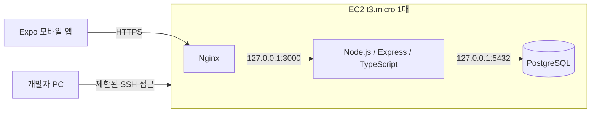

# EC2 단일 서버 개발 구성안

작성일: 2026-09-15 · 갱신: 2026-10-02 · 상태: 최소 구성 생성·검증 완료(HTTPS 제외). 실제 값과 검증 결과는 [EC2 개발 서버 기록](../infra/ec2-dev-server.md)을 따릅니다.

## 결정한 방향

마감한칸은 대학생의 과제, 세부 작업, 진행률, 마감과 제출 상태를 관리하는 모바일 앱입니다. 초기의 기기 내부 SQLite 저장 계획을 변경하여, AWS EC2 t3.micro 한 대에서 API와 PostgreSQL DB를 함께 운영하고 서버 코드를 원격으로 개발합니다. 이 문서가 이전 로컬 전용 구성보다 우선합니다.

## 기술과 배치

| 구분 | 구성안 |
| --- | --- |
| 모바일 | React Native + Expo + TypeScript |
| API | Node.js + Express + TypeScript, EC2에서 개발·실행 |
| DB | 같은 EC2의 PostgreSQL, localhost 연결만 허용 |
| 외부 연결 | Nginx에서 HTTPS 처리 후 내부 API로 전달 |
| 운영 | API 프로세스는 systemd로 관리, 재부팅 후 재시작 확인 |
| 리전 / OS | **시드니(ap-southeast-2)** — 계정 SCP가 다른 리전을 차단. Ubuntu 26.04.1 LTS |
| 인스턴스 | 요청된 t3.micro 1대. 메모리·CPU·디스크 사용량 측정 |
| 저장 공간 | 암호화된 gp3 EBS 20 GiB (생성됨). 예상 월 약 $15.2(인스턴스+EBS+공인 IPv4), Free plan 크레딧에서 차감 |

RDS, 로드밸런서, 별도 DB 서버는 초기 범위에 넣지 않습니다. 서버 한 대 장애 시 API와 DB가 함께 중단되는 구조이므로 학기 시연용 규모로 운영합니다.

## 개발 방법

1. AWS 로그인, 리전, 과금 조건과 사용할 SSH 접근 방식을 확인합니다.
2. 인스턴스 생성 전 t3.micro, EBS, 공인 IPv4, 데이터 전송, CPU 크레딧 관련 비용을 확인하고 지출 한도를 정합니다. 무료 사용 가능 여부를 미리 단정하지 않습니다.
3. 개발자별 SSH 접근을 준비하고, VS Code Remote SSH 또는 AWS 브라우저 연결 환경에서 서버 저장소를 편집합니다. 키와 비밀번호는 Git에 넣지 않습니다.
4. 한 사람의 작업 디렉터리를 공동 편집하지 않고, 각자의 작업 디렉터리와 기능 브랜치를 사용합니다. 테스트용 API는 내부 포트를 구분합니다.
5. 서버에서 API·DB 개발과 작은 단위 테스트를 수행합니다. 모바일 화면은 실제 휴대폰에서 확인하며, Android 에뮬레이터와 무거운 네이티브 빌드는 개발자 PC 또는 별도 빌드 환경에서 수행합니다.
6. 기능 PR을 develop에 병합하고 검증된 코드만 서버의 실행 디렉터리에 반영합니다. 안정 시연본은 master PR로 남깁니다.

## 접근 및 데이터 보호

- SSH 22번은 확인된 개발자 IP 또는 관리된 접속 경로로 제한합니다. DB 5432번과 API 3000번은 인터넷에 공개하지 않습니다.
- DB는 localhost에 바인딩하고, 애플리케이션 전용 최소 권한 계정을 사용합니다.
- 공용 DB를 쓰므로 최소한의 사용자 인증과 사용자별 데이터 접근 검사를 구현합니다. 다른 사용자의 과제 ID로 조회·수정·삭제가 되지 않는지 테스트합니다.
- 인증 방식과 계정 생성 범위는 3–4주차에 결정합니다. 인증 전 외부 시연은 합성 데이터만 사용합니다.
- 실제 환경 변수는 서버에 보관하고, 저장소의 .env.example에는 변수 이름과 예시만 작성합니다. AWS 루트 계정 정보·DB 비밀번호·개인 키를 문서나 앱에 넣지 않습니다.
- HTTPS 도메인과 인증서 설정 후 외부 앱 연결을 검증합니다. 미설정 상태를 운영 배포 완료로 표시하지 않습니다.
- DB 백업은 제한된 위치에 저장하고 서버 외부 보관·복구 절차를 준비합니다. 백업 방식과 추가 비용은 운영 전에 확정합니다.

## 핵심 기능과 DB

- users: 사용자 식별 및 인증에 필요한 최소 정보.
- assignments: 사용자 ID, 과목명, 제목, 마감 일시, 메모, 제출 상태.
- subtasks: 과제 ID, 내용, 완료 여부, 표시 순서.
- 날짜는 서버에 일관된 시간 기준으로 저장하고 모바일에서 현지 시간으로 표시합니다.
- 진행률은 세부 작업 완료 비율이며 0개일 때 0%입니다. 진행률 100%와 실제 제출 완료는 별도로 처리합니다.
- 과제 수정·삭제·제출 완료 시 모바일의 로컬 알림 예약을 갱신하거나 취소합니다. 다중 기기 동시 편집·서버 푸시는 이번 범위에서 제외합니다.

## 15주 일정의 변경점

| 주차 | 변경 또는 추가한 작업 | 완료 기준 |
| --- | --- | --- |
| 2 | 팀·협업 접근, EC2 구성안 | 초대 수락, 개인별 PR 실습, 폼 작성 상태 확인 |
| 3 | 사용자 요구 조사 + AWS 접속·비용 확인 | 계정 접속, 인스턴스 생성 조건 확인, 기준 기기 확정 |
| 4 | EC2/API/DB 연결 실험 + 사용자별 접근 설계 | 테스트 API·DB 연결, 화면 4개·ERD, 실제 기기 알림 실험 |
| 5 | 홈·등록 UI 및 API 요청 연결 | 입력 검증과 네트워크 오류 안내 |
| 6 | PostgreSQL 저장·조회 API | 앱 재실행 후 서버 데이터 조회, 소유자 접근 검사 |
| 7 | 수정·삭제·필터 | API 오류 처리, 삭제 취소, 수정값 유지 |
| 8 | 중간 시연 | 휴대폰 → API → DB 흐름 시연 |
| 9–10 | 세부 작업·진행률·마감·제출·알림 | 계산·시간 경계·알림 갱신 검증 |
| 11–13 | 통합·사용성·장애 테스트와 개선 | 연결 실패·인증·접근 권한·복구 시나리오 결과 |
| 14–15 | 안정본·발표·회고 | 실행·운영 안내, 시연, 개인 기여와 한계 설명 |

구체적인 수업 날짜와 발표일은 확인 후 조정합니다. 기존 일정표의 SQLite 항목은 위 PostgreSQL/API 작업으로 대체하는 계획입니다.

## 현재 완료 / 미완료

- 완료: GitHub 저장소와 기본 문서·브랜치·보호 규칙·Projects·Wiki.
- 완료: min2030 Collaborator 초대 수락 (write 권한, 2026-10-02 확인).
- 완료: 맥북 로컬 개발 환경과 앱·API 최소 골격, 로컬 PostgreSQL 18 연결 검증 ([세팅 기록](../setup/pc-setup-2026-10-02.md)).
- 완료: EC2 t3.micro·암호화 EBS·SSH 제한 보안 그룹 생성, PostgreSQL 18·API systemd 구성, 재부팅·백업 복원·터널 연결 검증 (2026-10-02).
- 미완료: HTTPS 도메인·Nginx, 사용자 인증, 핵심 기능 구현, 실기기 테스트.
- 미완료: 각 팀원의 개인 PR 실습과 팀 폼·LMS 제출. 폼은 입력 예시를 준비하며 제출하지 않습니다.
